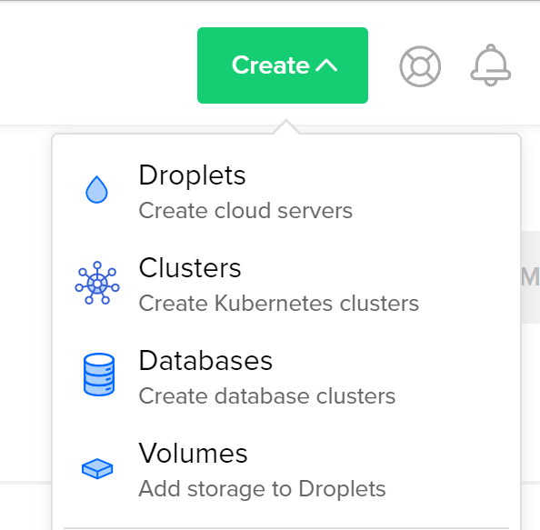

## WPS科学上网教程

<font size = 15, color='red'>严正声明</font>

<font size = 5, color='red'>网络不是法外之地！非法浏览国外网站是违法行为，不可利用技术手段非法突破我国网络边界。本教程仅限于个人笔记范畴，不可利用其中内容浏览非法内容、行危害我国网络安全之事。毋庸置疑，作者坚决拥护社会主义，时刻践行社会主义核心价值观，是一名遵纪守法的好青年。</font>

```java
/**
  * @author: zhang zhao
  * @date: 2019/06/08
  * @version: 0.0
  */
```

### 创建Droplets

在Digital Ocean主页选择`Create—>Droplets`，如图所示。




### 主机设置

在当前页面依次选择设置项。

1. Choose an image

   一般选择`Ubuntu 18.04 x64`，根据自己需求也可选择其他Linux发行版。

2. Choose a plan

   如果服务器访问量不大（如主要用于~~get across the Great Firewall~~），选择最低配置的$5种类即可。

3. Add backups

   需要额外费用，为主机月租的20%，一般没有需求不选择。

4. Add block storage

   添加可以在不同主机中移动的存储，一般不需要

5. Choose a datacenter region

   选择主机所在地区，列出的地区如下图

   

   实际对于一台特定的主机，并不是所有的区域都可以选择，不能选择的地区会显示为灰色。比如图中的纽约1号计方，旧金山1号机房和阿姆斯特丹2号机房都不可选。

   不同地区的主机在中国大陆的访问速度也不同。可以利用Digital Ocean官方的测速工测试。网址为[Digitl Ocean speed test](<http://speedtest-sfo1.digitalocean.com/>)

   需要指出的是，由于中国三大运营商走的国际线路不同，因此同一个机房在不同运营商的网络代理下速度也不一样。

   目前来看，表现比较好的机房有阿姆斯特丹、伦敦、班加罗尔。旧金山1号和新加坡机房之前速度挺快，但最近似乎比较慢，并且有被墙的风险。考虑到中美贸易战的影响，最好不要选择美国的机房，建议选择欧洲和印度的机房。现在（2019年6月8日）**推荐的是班加罗尔的机房**，测速很快，实际使用也比之前的新加坡机房要快。猜想的原因可能是印度距离中国比较近（但中印隔着喜马拉雅山，可能线路最终还是从欧洲或东南亚绕过来的）。

6. Select additional options

   可选项，推荐勾选`IPv6`，这样可以上北邮人一类的纯IPv6 pt站。

7. Add your SSH keys

   这一步是比较关键的一步。如果选择SSH登录主机的话，这一步必不可少，当然可以选择不用SSH登录，但我没试过。

   首先需要下载`PuTTY`，并安装，这一步不赘述。安装完成后在Windows开始菜单中看到的PuTTY系列如下图所示：

   

   首先打开`PuTTYgen`，会看到如下所示的界面。

   

   `Type of key to generate`选择`RSA`，`Number of bits to generate key`设为`2048`即可。

   点击`Generate`按钮，出现进度条，此时正在产生密钥对，移动鼠标使得光标在空白区域随机移动，否则进度条会停滞不前，这样的目的是产生随机的独一无二的密钥对。

   

   完成后会出现上图界面。在`Key passphrase`中输入密码，并`Confirm passphrase`，这个是私钥的密码，也将是将来登录主机时需要输入的密码。

   依次选择`Save public key`和`Save private key`，保存公钥和私钥在一个你能找到的位置，保存的格式为`ppk`格式，命名可以随意，但为了易于辨识，可以命名为`public_key.ppk`和`private_key.ppk`。

   **保存完毕后不要关闭此页面。**把图中的那一串神秘代码（就是公钥）复制下来（全选复制即可）。现在回到Digital Ocean主机创建页面，在`Add your SSH keys`中选择`New SSH key`，在弹出的对话框中粘贴刚刚复制的公钥，如果这是一个合法的公钥代码，方框右边将会出现一个绿色的√鼓励你一下。然后给这个公钥（随便）起个名字，当然为了辨识度，还是起个有意义的名字，比如`pub_key_20190608`。这样添加公钥就完成了。

   这里提一下为什么上一段说“保存完毕后不要关闭此页面”。如果关闭了这个页面，也是可以通过文本编辑器打开保存的公钥ppk文件找到公钥代码的，但这时复制过来经常会出现问题，可能是换行符的问题，此时方框的右边会给你一个红色的×反鼓励你一下。

8. Finalize and create

   最后一步，检查一下设置信息。并且可以给自己的主机命名，这个命名将作为自己的主机名。也可以使用默认的名字。

到这一步就完成了一个big step了哦。可以点击`Create`按钮了。页面将跳转到Droplets，等进度条结束，就可以看到你的主机IP地址了，这标志着你已经有了一台自己的虚拟个人服务器（VPS）了。如下图所示（我有两个Droplets）：


### 登录主机

现在就可以用`PuTTY`登录你的主机了。首先打开`PuTTY`（not `PuTTYgen`）。


主界面就是这样子。在`Host Name (or IP address)`方框中填入自己的IP地址，`Port`就用默认的`22`。`Connection type`选择`SSH`。一切按照默认的来就行。

接着选择`Connection->SSH->Auth`，如下所示：


点击`Browse...`，选择之前保存的私钥ppk文件即可。之后再点击`Session`按钮，回到最初的起点。在`Saved Sessions`方框中输入一个名字，当然也是可以随便起的。点击`Save`按钮，就可以看到方框中出现了一个你刚刚的命名。以后每一次要登录主机，就双击你的`Session`名，点击`Load`，在点击`Open`即可。

点击`Open`后，就会出现一个黑框（并没有眼镜）。等待几秒（也许不需要等待），就会出现`login as:`几个不大不小的字，在后面输入`root`，并按`Enter`键，会出现让你输入密码的界面。


这里要输入的密码就是保存密钥时输入的密码。输入密码时屏幕上是什么都不显示的，（闭着眼睛）输入即可。输入完了`Enter`一下。这时你就登录上了你的主机了，界面如下所示：


现在就可以准备安装科学上网的工具了。

### 使用Shadowsocks

至于什么是Shadowsocks呢，我这里就懒得说了，直接说怎么操作。一下所有输入均为命令行输入，基础是你已经登录了主机，并出现了上面那张图。

首先输入`sudo apt update`，会升级什么什么玩意，不管。

然后来一个`sudo pip3 install shadowsocks`，这就安装好Shadowsocks了。

现在开始配置Shadowsocks。输入命令`sudo vim /etc/shadowsocks.json `，这个命令是用`vim`创建一个空的json格式文件，而我们需要在里面输入一些内容。首先按`i`键进入编辑模式，此时页面左下角会出现`--INSERT--`字样。接着输入如下代码（你可能会想着来一套`Ctrl-C`, `Ctrl-V`，但在`vim`下这个行不通，至于怎么复制粘贴，我也不会，所以暂时还是老老实实敲代码进去。在`vim`中全键盘操作，鼠标没用）：

```json
{
    "server": "0.0.0.0",
    "server_port": 12345,
    "local_address": "127.0.0.1",
    "local_port": 1080,
    "password": "your password",
    "timeout": 300,
    "method":"aes-256-cfb",
    "fast_open": false
}
```

其中可以更改的地方为：

+ `server_port: 12345`：后面的端口号随便输入，开心就好，`0-65536`之间都是OK的，但为了稳妥，还是建议输入`8000`以后的数字。
+ `password: "your password"`：自己的密码，毋庸多言。这个密码是后面在Shadowsocks客户端登录时要用的

输入完毕后检测一下有没有错。没错的话按一下`ESC`键，注意到此时左下角变成了`/etc/shadowsocks.json`等等文字。再输入`:wq`，按`Enter`键退出`vim`编辑模式。

用如下命令启动Shadowsocks:

`ssserver -c /etc/shadowsocks.json -d start`

如果正常的话，Shadowsocks就启动了，会看到一些友善的提示，表明了Shadowsocks已经在运行。

当然天有不测风云，运行这一步命令后可能会出现错误（如果没有那是最好了），报错形式如下：

```python
AttributeError: /usr/local/ssl/lib/libcrypto.so.1.1: undefined symbol: EVP_CIPHER_CTX_cleanup
shadowsocks start failed
```

原因是`openssl`升级到`1.1.0`以上版本，导致shadowsocks2.8.2启动报`undefined symbol: EVP_CIPHER_CTX_cleanup`错误。解决办法如下：

1. 输入`vim /usr/local/lib/python3.6/dist-packages/shadowsocks/crypto/openssl.py`，打开文件
2. 按`i`键进入编辑模式，找到第52行（或者附近），将`libcrypto.EVP_CIPHER_CTX_cleanup.argtypes`替换为`libcrypto.EVP_CIPHER_CTX_reset.argtypes`
3. 同样找到第111行附近，同样将`libcrypto.EVP_CIPHER_CTX_cleanup.argtypes`替换为`libcrypto.EVP_CIPHER_CTX_reset.argtypes`
4. 修改完毕，按`ESC`键，再输入`:wq`退出。

这时再次运行：

`ssserver -c /etc/shadowsocks.json -d start`

就会正常启动了，并出现了一些比较友善的提示，这样服务器端的Shadowsocks就配置完成了。

### 使用BBR加速

`BBR `可以加速TCP，尽可能跑满带宽, 并且尽量不要有排队的情况。在网络环境较差的情况下，使用`BBR`有比较好的效果。总而言之，使用`BBR`加速后网速会更快。操作步骤如下：

1. 修改系统变量

   ```shell
   echo "net.core.default_qdisc=fq" >> /etc/sysctl.conf
   echo "net.ipv4.tcp_congestion_control=bbr" >> /etc/sysctl.conf
   ```

2. 保存生效

   ```shell
   sysctl -p
   ```

3. 查看内核是否已开启`BBR`

   ```shell
   sysctl net.ipv4.tcp_available_congestion_control
   ```

   显示以下即为开启

   ```shell
   net.ipv4.tcp_available_congestion_control = bbr cubic reno
   ```

4. 查看`BBR`是否启动

   ```shell
   lsmod | grep bbr
   ```

   显示以下即为开启

   ```shell
   tcp_bbr                20480  14
   ```

部分显示会有细微不同，只要没有疯狂报错即可。


如果以上所有内容都完成了，那么可以关掉`PuTTY`，也就是说，服务器端的事情都做完了。下面可以进行客户端的设置。

### 客户端Shadowsocks配置


如图所示，服务器IP、服务器端口、密码需要修改，填入`/etc/shadowsocks.json`配置文件里的东西就行了。点击`确定`按钮。

客户端的Shadowsocks同样需要一些设置。


+ `系统代理模式`选择`PAC模式`

+ `代理规则`选择`绕过局域网和大陆`

+ `PAC`那里可以选择`更新为GFWList`，稍等片刻会弹出提示更新成功。

  

  以上步骤结束，就可以打开浏览器试试[Google](www.google.com.hk)啦。


## `Jupyter Notebook`导出`PDF`

### 安装`nbconvert`

```shell
pip install nbconvert
# OR
conda install nbconvert
```

Anaconda发行版已经预安装了这个包，因此不需要另行安装。

### 安装`Pandoc`

`Linux(Debian, Ubuntu)`下安装

```shell
sudo apt-get install pandoc
```

### 安装Tex

`Linux(Debian, Ubuntu)`下安装

```shell
sudo apt-get install texlive-xetex
```

此时已经可以导出`PDF`文件了，但是不支持中文，因此需要处理中文支持。

### 安装 `texlive-lang-cjk` 语言包

```shell
sudo apt-get install texlive-lang-cjk
```

### 修改`TeX`模板文件

打开`article.tplx`文件，我的路径为`/anaconda/anaconda3/pkgs/nbconvert-5.4.1-py37_3/lib/python3.7/site-packages/nbconvert/templates/latex/article.tplx`。

将`documentclass [11pt]{article}`修改为

```latex
documentclass [11pt]{article}
\usepackage{ctex}
```

完成以上工作就可输出支持中文的`PDF`文件了。

### 参考资料

+ [nbconvert-doc](https://nbconvert.readthedocs.io/en/latest/install.html#installing-tex.)
+ [notebook安装](<http://blog.lisp4fun.com/2017/10/11/noteboot-setup>)


--end--


